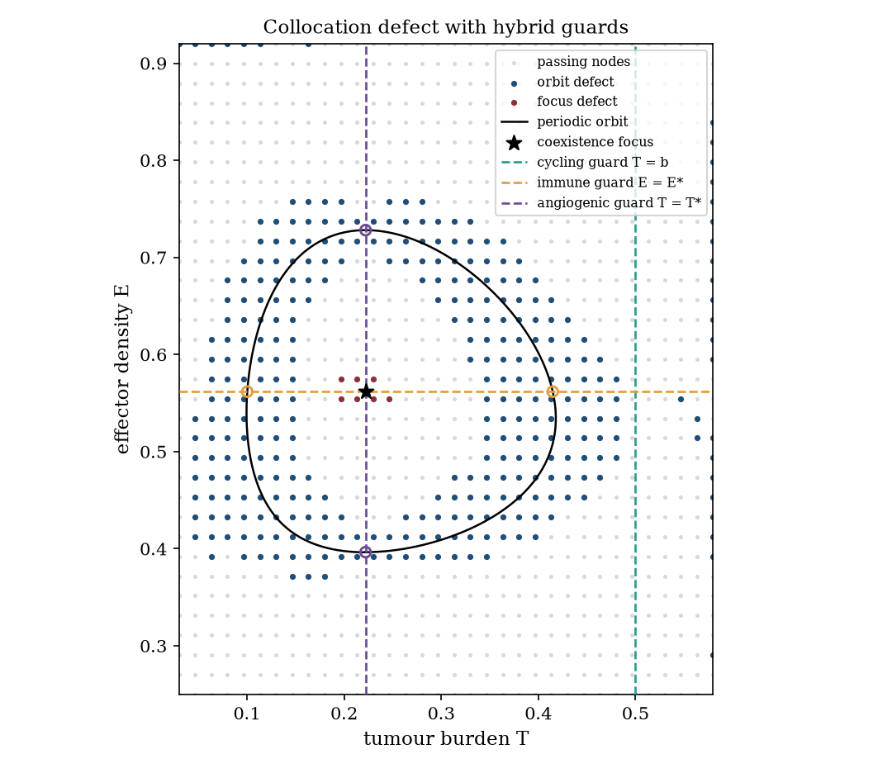
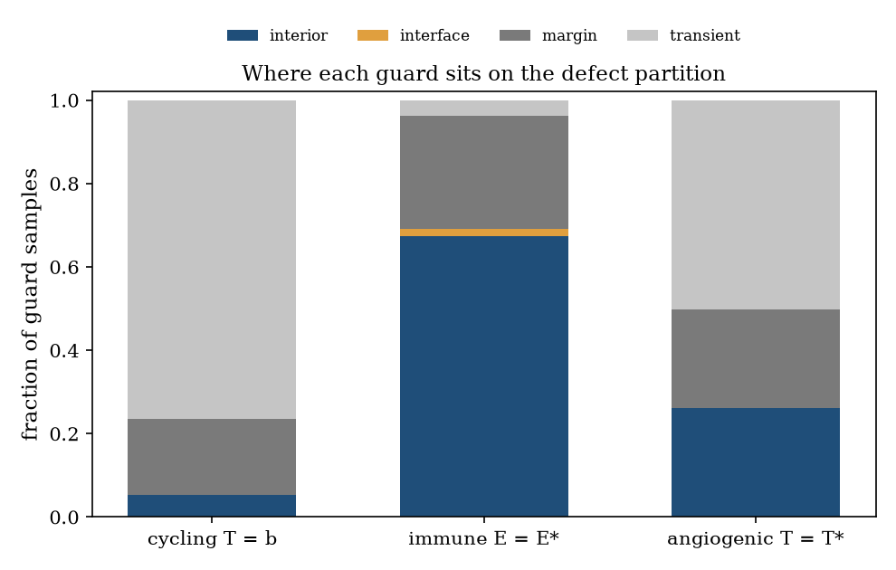
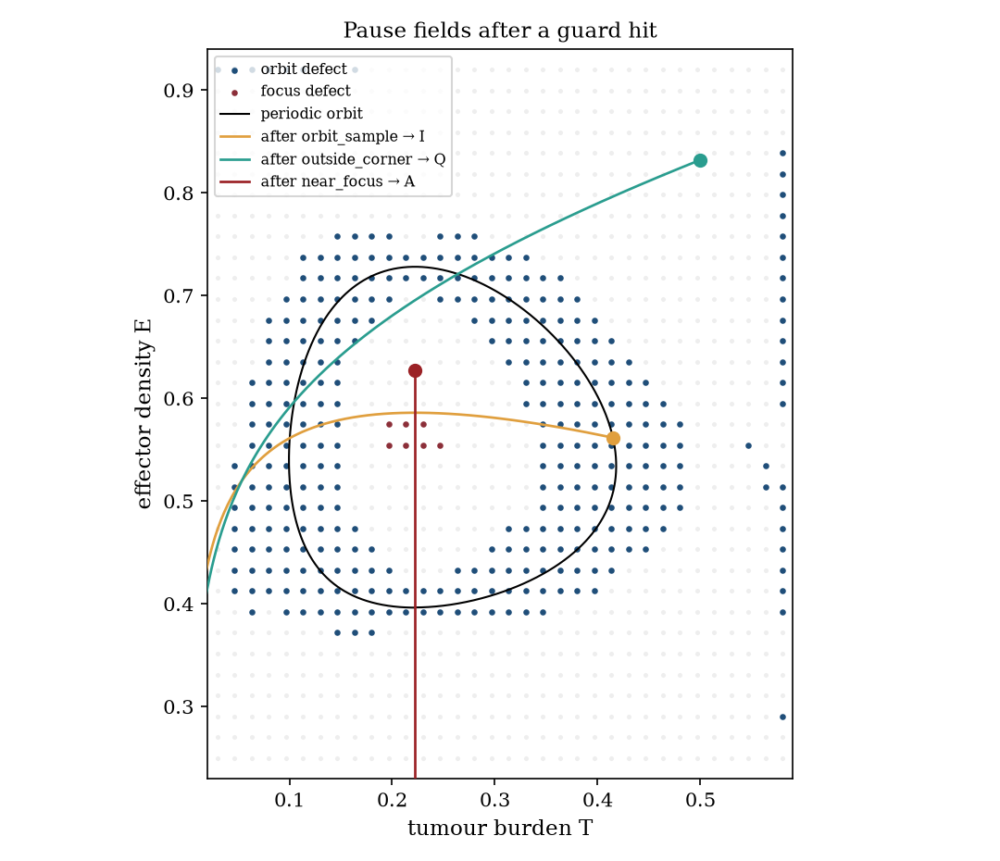
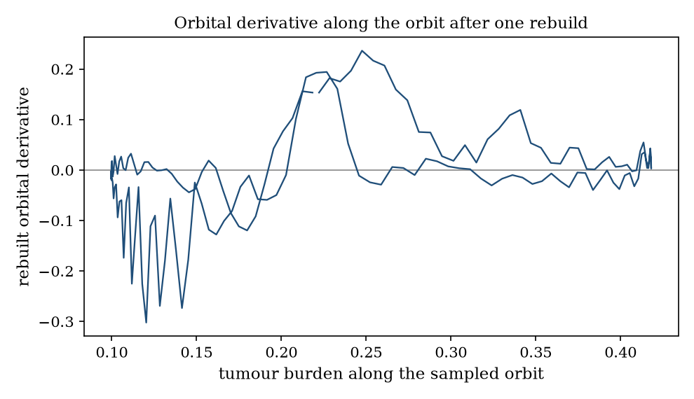
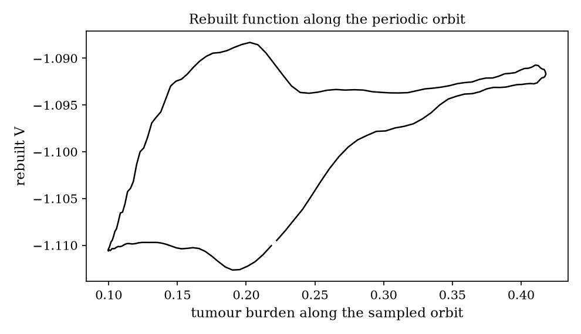
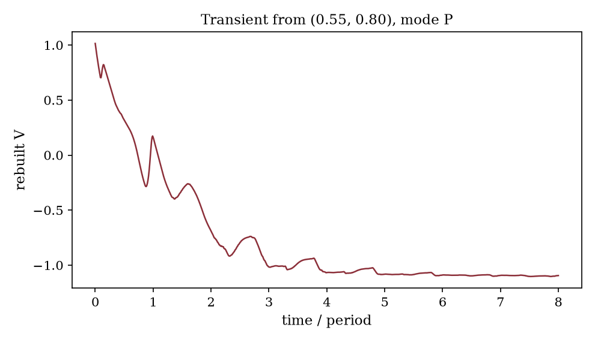

# Hybrid occult mode switches versus chain-recurrent components on a joint hybrid–smooth field

**Thesis #26. Computational research thesis**  
**Depends on:** Thesis #4 (hybrid occult modes) and Thesis #17 (complete Lyapunov partition)  
**Author:** Kelechi Emeka Ogbonna  
**Correspondence:** kelechiogbonna300@gmail.com · https://github.com/cloudynirvana/thesis-26-chain-recurrent-vs-hybrid-occult  
**Date:** 21 September 2026  
**Format:** B.Sc. project chapters (Nile University style), written as a computational methods manuscript  
**Status:** One joint toy, a seeded collocation, and three hybrid trajectories. Not a measurement of residual disease.  
**Citation style:** numbered Vancouver. A `doi:` field appears only where Crossref returned the record.  
**DOI:** none for this document. Do not invent one.

---

## Title page

**HYBRID OCCULT MODE SWITCHES VERSUS CHAIN-RECURRENT COMPONENTS ON A JOINT HYBRID–SMOOTH FIELD**

BY

**KELECHI EMEKA OGBONNA**

A COMPUTATIONAL RESEARCH THESIS  
(IN-SILICO HYBRID GUARDS ON A PLANAR TUMOUR–EFFECTOR FIELD)

SUBMITTED AS A CITEABLE MANUSCRIPT FOR JOURNAL / THESIS HANDOFF

PROJECT CONFLUENCE  
INDEPENDENT COMPUTATIONAL RESEARCH

SUPERVISOR: not appointed for this deposit

SEPTEMBER 2026

---

## Declaration

I, Kelechi Emeka Ogbonna, declare that this computational research thesis was carried out by me. The orbit, the collocation defect, the guard classes, and the hybrid trajectories reported here were produced by `sim/joint.py` at run label 20260921. The arithmetic is deterministic. They are not wet-lab measurements and not patient outcomes. No DOI, ORCID, or journal acceptance was invented for this document. No figure and no table entry was copied from Thesis #4 or Thesis #17.

_________________________     _______________________  
Kelechi Emeka Ogbonna         Date

---

## Abstract

On a joint hybrid–smooth toy, do hybrid occult mode-switch observables align with chain-recurrent components from a complete Lyapunov construction, or can switches fall inside a single recurrent region?

The smooth piece is a planar tumour–effector field with four declared constants. Its coexistence state is an unstable focus, eigenvalues 0.008547 ± 0.328054 i, inside a periodic orbit of period 19.876. The orbit meets an immune guard E = E* at tumour burdens 0.4149 and 0.1004, and an angiogenic guard T = T* at effector densities 0.3965 and 0.7281. Each of those four points lies at least 0.122 from the focus. A cycling guard T = b = 0.5 misses the orbit, whose tumour coordinate stops at 0.418. A Wendland collocation on a 34×34 grid, cut at γ = −0.55, marks 339 of 1156 nodes failing. The four orbit hits fall in the interior of one connected defect component, of size 301, on that grid and on a 22×22 grid and a 42×42 grid. The focus is a separate blob of 7 nodes on the 34×34 grid, 5 nodes on the 42×42 grid, and it is missed on the 22×22 grid. A transient started at (0.55, 0.80) crosses the cycling guard outside the defect. Another trajectory crosses the angiogenic guard in the gap between the focus and the orbit.

The failing set is a collocation defect. It is not a certified Conley set. Along the orbit the rebuilt orbital derivative is positive on 47.6 percent of samples, the peak-to-peak change of the rebuilt function is 0.0243, and a transient drop over eight periods is 2.109. Five further hard rebuilds let the failing fraction drift from 0.293 to 0.495. Pause fields built by deleting terms, with no new rate, have no equilibrium inside the window. After a switch into quiescence or the immune-held field, a declared detection predicate becomes true. After a switch into angiogenic pause, tumour burden is held at 0.222 and the predicate stays false.

Research only. Not a medical device, not a dormancy assay, and not a cure.

---

## Keywords

hybrid modes; switching observable; chain recurrence; complete Lyapunov function; Wendland collocation; Filippov convention; tumour–effector toy; occult predicate; research only

---

## Table of Contents

DECLARATION  
ABSTRACT  
Table of Contents  
List of tables and figures  

CHAPTER ONE. INTRODUCTION  
1.1 Background to the study  
1.2 STATEMENT OF RESEARCH PROBLEM  
1.3 JUSTIFICATION OF STUDY  
1.4 AIM AND OBJECTIVES OF THE STUDY  
1.5 SIGNIFICANCE OF THE STUDY  
1.6 SCOPE OF THE STUDY  

CHAPTER TWO. LITERATURE REVIEW  
2.1 Three pauses, and a mode that is not a parameter  
2.2 Chain recurrence on a smooth field  
2.3 A collocation that can fail in public  
2.4 The planar field those pauses are asked to share  
2.5 What the two deposits already closed  

CHAPTER THREE. MATERIALS AND METHODS  
3.1 Design  
3.2 Four vector fields, one set of constants  
3.3 Guards, a Filippov sign test, and an occult predicate  
3.4 Normalised field and collocation  
3.5 Components, radii, and the alignment rule  
3.6 Checks that do not certify the set  
3.7 What was not done  

CHAPTER FOUR. RESULTS  
4.1 An unstable focus and a periodic orbit  
4.2 The defect on three grids  
4.3 Where the guards sit  
4.4 Three trajectories that switch  
4.5 Signs across the guards  
4.6 A derivative that will not stay negative  

CHAPTER FIVE. DISCUSSION, CONCLUSION AND RECOMMENDATION  
5.1 Discussion  
5.2 Conclusion  
5.3 Recommendation  

REFERENCES  
DISCLAIMER  

---

## List of tables and figures

**Table 3-1.** Declared constants and the closed-form coexistence state.  
**Table 3-2.** Mode fields. Shared constants, different structure.  
**Table 3-3.** Guards.  
**Table 3-4.** Collocation settings.  
**Table 3-5.** Classification radii, in units of the larger spacing.  
**Table 4-1.** Equilibria of the proliferative field.  
**Table 4-2.** Orbit, approach trials, and pause-field speeds in the window.  
**Table 4-3.** Cuts on three grids.  
**Table 4-4.** Connected components of the primary defect.  
**Table 4-5.** Guard samples on the primary partition.  
**Table 4-6.** Orbit crossings, and their class on three grids.  
**Table 4-7.** Hybrid trajectories.  
**Table 4-8.** Filippov signs on the three guards.

**Figure 4-1.** Collocation defect, periodic orbit, focus, and the three guards.  
**Figure 4-2.** Class fractions along each guard.  
**Figure 4-3.** Pause-field traces after a guard hit.  
**Figure 4-4.** Rebuilt orbital derivative along the orbit.  
**Figure 4-5.** Rebuilt function along the orbit.  
**Figure 4-6.** Rebuilt function on a transient.

Figures are diagnostics from `sim/joint.py`. They are not measured lesions.

---

# CHAPTER ONE

## 1.0 INTRODUCTION

### 1.1 Background to the study

Cancer incidence is a demographic fact, and the 2022 estimates are large [1]. The hallmark list that sits next to those estimates is a narrative taxonomy of phenotypes [2]. Dormancy is one of the phenotypes the taxonomy keeps having to make room for. A residual cell can sit cycling and still not grow as a mass, or it can leave the cycle, or an immune response can hold a clone that a scan does not see [3–5]. Those are three different pauses. Angiogenic suppression can balance proliferation against death in a micrometastasis [6,7]. Adaptive immunity can hold an occult clone in equilibrium [8,9]. Writing all three as one hidden continuous coordinate throws the difference away.

Thesis #4 made that difference into a hybrid object. Quiescence, angiogenic pause, and immune-held latency are discrete modes. A guard reads an observable. The mode is not a parameter, and occult is a predicate, not an extra state [10]. The manuscript stopped at the specification. It did not integrate a vector field, and it said so.

A smooth planar tumour–effector equation already has its own partition of phase space. Kuznetsov and colleagues fitted a saturated kill to a growing tumour and an effector population, and the phase plane of that family contains foci, saddles, and periodic orbits [11]. Chain recurrence is the relation that collects equilibria and periodic orbits into the set a complete Lyapunov function is allowed to be flat on [12,13]. A meshless collocation can try to build that function from the vector field alone, by asking the orbital derivative to equal −1 off the recurrent set and 0 on it [14,15]. Thesis #17 ran that construction on one planar field and kept a hard sentence: the failing set is a collocation defect, and a certified Conley set was not obtained [16].

The two sentences have not been asked of one toy. A mode switch is a crossing of a guard. A chain component is a piece of the recurrent set of a flow. If those were the same computational object, a guard would have to sit on the interface between components. If a guard cuts through one component, or through the transient complement, then "mode" and "recurrent component" are different objects even on a toy small enough to draw. May's warning applies before any biological noun is reused as a row label [17]. A model that serves a sentence about patients has a different job, and this deposit does not take that job [18].

### 1.2 STATEMENT OF RESEARCH PROBLEM

On a joint hybrid–smooth toy, do hybrid occult mode-switch observables align with chain-recurrent components from a complete Lyapunov construction, or can switches fall inside a single recurrent region?

The working form is narrow. There is one proliferative field, with a closed-form coexistence state. There are three pause fields obtained by deleting terms, using the same four constants. There are three guards, each a level set of an observable built from those constants. There is one collocation, on three Cartesian grids, with a cut chosen from a menu of three. The alignment rule is fixed in the script before the classes are read off: a guard aligns only when its samples lie in the transient complement or on the interface of two defect components, and a switch falls inside one recurrent piece when an orbit crossing lands in the interior of a single component under that rule.

The periodic orbit and the focus are the chain-recurrent candidates the smooth field actually has in the window. The collocation is the computational stand-in for a complete Lyapunov partition. Agreement between a guard and that stand-in is a numerical statement. It becomes a statement about chain components only to the extent the orbit and the focus are disjoint recurrent pieces, which Section 4.1 records, and only with the limit in Section 4.6: a positive orbital derivative on the orbit blocks any reading of the defect as a certified Conley set [12,16].

### 1.3 JUSTIFICATION OF STUDY

Thesis #4 can be satisfied by a table of modes and still leave the phase plane untouched [10]. Thesis #17 can partition a smooth field and never mention a guard [16]. Either deposit can be cited as if the other had answered the overlap. The overlap is the question. A clinic-facing reading would treat a mode name and a basin name as synonyms. The toy is small enough that the synonym can be scored.

The score has two layers, and they are not interchangeable. The geometric layer uses the sampled orbit and the focus. A point of the orbit lies in that orbit. If the point is not the focus, it is not the other recurrent piece. The collocation layer thickens both pieces into nodes and can be wrong in either direction: a tube fatter than the orbit, or a focus the coarse grid misses. Publishing both layers is the reason the study is worth running. A single picture of failing nodes would hide which layer carried the answer.

The study is not justified as a detector of residual disease, a rule for when to call a scan negative, or a map from a chain component onto a treatment response [17,18].

### 1.4 AIM AND OBJECTIVES OF THE STUDY

The aim is to test, on the joint toy in Chapter Three, whether three predeclared mode-switch observables line up with the chain-recurrent pieces of the smooth field and with the collocation defect that stands in for a complete Lyapunov partition.

The objectives are:

1. Locate the coexistence state, its linearisation, and a periodic orbit of the proliferative field.
2. Define quiescence, angiogenic pause, and immune-held latency by structural deletion, with no new rate.
3. Place three guards at levels fixed by the shared constants, and class their samples and the orbit crossings against the defect.
4. Integrate three hybrid trajectories, record the state at the first hit, and evaluate a declared occult predicate after the switch.
5. Report the orbital derivative along the orbit after the rebuild, so that a collocation defect is not promoted to a certified Conley set.
6. Keep clinical detection, dosing, and any reading of a mode as a waiting time outside the aim.

Non-aims. Estimating the four constants. Adding a continuous occult coordinate. Certifying an ε-chain. Ranking drugs. Interpreting a coordinate name as an assay.

### 1.5 SIGNIFICANCE OF THE STUDY

The useful product is a counterexample that can be rerun, or an alignment that can be rerun. If every orbit crossing had landed on the interface of two components, the claim that a switch can fall inside one recurrent piece would fail on this toy. If the cycling guard had cut the periodic orbit, the claim that a switch can also fall in the transient complement would have needed a different witness. Chapter Four names which of those sentences the script returned.

There is a second product inside the same run. The defect can contain a guard sample that is far from the geometric orbit, and the coarse grid can miss the focus. Those are reasons to keep the geometric crossings in the result even when the picture looks clean [14,16].

What the significance is not: a dormancy biomarker, a Conley index of a patient, or a replacement for the hallmark list [2–5].

### 1.6 SCOPE OF THE STUDY

In scope. One planar field. Three structural pause fields. Three line guards. Three Cartesian grids. One cut menu. Three hybrid initial conditions. A finite-time return on the primary nodes. The radii in Table 3-5.

Out of scope. Human or animal data. A fitted threshold. Interval arithmetic. A hexagonal lattice. The quadratic program that sharpens a complete Lyapunov function. An immunotherapy coordinate. A regulatory use.

---

# CHAPTER TWO

## 2.0 LITERATURE REVIEW

### 2.1 Three pauses, and a mode that is not a parameter

The dormancy reviews separate cellular quiescence from an angiogenic pause and from immune equilibrium, even when a single patient-level word covers all three [3–5]. Holmgren, O'Reilly and Folkman described micrometastases held by a balance of proliferation and apoptosis under angiogenic suppression [6]. The angiogenic switch is a change in that balance, not a change in the cell-cycle label [7]. Koebel and colleagues showed that adaptive immunity can maintain an occult cancer in equilibrium, and that depletion of that immunity lets the same cells grow out [8]. Dunn, Bruce, Ikeda, Old and Schreiber set that equilibrium inside the broader immunoediting sequence [9]. Naumov and colleagues made the angiogenic switch from a non-angiogenic phenotype into an experimental model of dormancy [19]. Goddard, Bozic, Riddell and Ghajar put immune context back next to the niche, which is a reminder that the three pauses can co-occur in a tissue even when a model is forced to pick one mode at a time [20].

Mathematical models of dormancy have usually stayed continuous: a delay, a small compartment, or a slow variable [21]. A continuous remainder is easy to estimate and easy to smuggle. Pantel, Brakenhoff and Brandt treat detection of disseminating cells as an assay problem with its own false negatives [22]. Uhr and Pantel argue that clinical dormancy is still a contested reading of those assays [23]. A predicate that fires only when a burden coordinate is below a floor and the mode is one of the three pauses is a way to keep the assay sentence and the mode sentence from collapsing into each other. Thesis #4 wrote that predicate, and refused the extra coordinate [10]. This thesis uses the predicate on a toy. It does not calibrate the floor.

Hybrid and piecewise-smooth systems are the dynamical setting in which a mode is a discrete location [24–27]. Filippov's convention fills in the vector field on the surface where two smooth fields meet, by a convex combination that is tangent to the surface when both fields point into it [24]. di Bernardo, Budd, Champneys and Kowalczyk develop the local singularities of those surfaces [25]. Liberzon treats switching as a control structure with its own stability questions [26]. Goebel, Sanfelice and Teel give the hybrid inclusion a systematic Lyapunov theory [27]. Peng and Xiang put a Filippov convention on a tumour–immune threshold [28]. The convention is available here as a sign test. It is not a fitted sliding therapy.

Thesis #4 also fixed a discipline this deposit keeps. The four fields share their constants. A mode may delete or replace a term. A mode may not introduce a private rate and call it identified [10]. Smoothing a guard with a steep sigmoid whose steepness is a new parameter is the same smuggle in smoother clothes. The guards below are sharp level sets.

### 2.2 Chain recurrence on a smooth field

Conley's isolated-invariant-set theory supplies the decomposition a complete Lyapunov function sees: the chain-recurrent set, and a function that strictly decreases off it [12]. Hurley extended the chain-recurrent picture to flows and semiflows, including the relation between chain components and attractors [13,29]. A point is chain recurrent when, for every ε > 0 and every time T, an ε-chain from the point returns to it in time at least T. An equilibrium is chain recurrent. A periodic orbit is chain recurrent. They are the same chain component only when ε-chains run both ways.

On a planar field, a repelling focus inside an attracting periodic orbit is the standard pair of distinct components. Chains leave the focus by following the flow. For small ε they do not jump back from an attracting orbit to the focus, because the flow returns them to the orbit. That separation is classical [12,13]. It is not, by itself, a computer-assisted proof that a particular numerical curve is the orbit. Kalies, Mischaikow and VanderVorst give an algorithmic outer approximation of chain recurrence by combinatorial multivalued maps [30]. Dellnitz, Froyland and Junge built the set-oriented machinery behind GAIO for the same geometric question [31]. Neither algorithm is run here. They are cited so that a cloud of failing nodes is not mistaken for one of them.

A complete Lyapunov function is constant on each chain component and strictly decreasing on the orbits that join them. Existence with a prescribed orbital derivative has been proved for flows under stated hypotheses [32]. The prescription used in computation is usually −1 off an approximation of the recurrent set. The theorem does not say that a radial-basis interpolant which almost meets the prescription has found the set.

### 2.3 A collocation that can fail in public

Giesl and Wendland estimated the error of meshless collocation for orbital derivatives [33]. Wendland's compactly supported kernels make the matrix sparse in exact arithmetic and merely banded in practice; the function used below is ψ4,2 [34]. Giesl and Hafstein review the numerical construction of Lyapunov functions, including the complete case [15]. Argáez, Giesl and Hafstein iterate a collocation whose right-hand side is −1 on nodes that still decrease and 0 on nodes that do not, after a speed normalisation that keeps equilibria from dominating the derivative by a vanishing speed [14]. A later paper replaces the hard iteration by a minimisation with differential inequalities [35]. The 2017 conference paper is the same programme at an earlier cut [36].

Thesis #17 implemented one rebuild of that hard scheme on a planar cancer-state field and published the ways it fails [16]. The failing set covered the periodic orbit only up to a grid spacing. The orbital derivative along the orbit did not stay non-positive. The focus was visible on fine grids and missed on a coarse one. A further iteration drifted. The manuscript called the failing set a collocation defect and refused the phrase "certified Conley set". This thesis uses the same formulae, on a field with the same four constants, because the dependency is the method and the honesty rule, not a table of borrowed numbers. Every entry in Chapter Four is recomputed by `sim/joint.py`. Where a digit happens to lie near a digit in Thesis #17, that is the field, not a copy.

The speed normalisation, the support radius of nine spacings, the flow-aligned stencil, and the mean rule rather than an any-point rule are inherited as design choices of that method [14,16]. The any-point rule marks a fatter set. It is computed nowhere in this deposit. The cut is still chosen from a menu after the menu is seen, which is a limitation, and the rejected cuts are stored for that reason.

### 2.4 The planar field those pauses are asked to share

Reviews of tumour–immune equations already warn that a planar caricature is a phase portrait, not a patient [37,38]. Kuznetsov's saturated kill is the caricature used here [11]. Kirschner and Panetta added immunotherapy as an input [39]. This deposit does not. Effector density is a coordinate. It is not a dose, and it is not the immune-equilibrium class of Thesis #4 until a guard is declared [10]. Eftimie, Bramson and Earn catalogue how many such planar models exist and how little of their bifurcation structure is identifiable from the kind of data a clinic records [37]. Altrock, Liu and Michor make the same point for quantitative cancer models more broadly [38].

The joint object is therefore deliberately poorer than either literature. The smooth field is one vector field. The hybrid structure is three deletions and three lines. Structural and practical identifiability of the four constants is a separate question, and it is not reopened [40,41]. The question here is whether the lines and the recurrent pieces meet.

### 2.5 What the two deposits already closed

Thesis #4 closed the definitional question: occult is not a licence to add a state, and a mode is not a parameter [10]. Thesis #17 closed the smooth question on this family of fields: a collocation can track a periodic orbit and still leave a positive orbital derivative along it [16]. Neither deposit overlaid a guard on a defect. The neighbouring hazard and spectral theses are about other objects and are not sources of numbers here.

The critical problem is the overlay. If the guards had only touched the boundary between the focus and the orbit, mode and component would have been the same object on this toy. Chapter Four is the record that they do not.

---

# CHAPTER THREE

## 3.0 MATERIALS AND METHODS

### 3.1 Design

The constants, the window, the guards, and the radii are declared in the script. No time series is read from a file. No random sample is drawn for the production numbers. The run label 20260921 is stored in `sim/results.json` and is not an input to the arithmetic. A self-test uses a fixed random generator only to check the orbital-derivative formula on a linear rotation, and to check that a five-node collocation with target −1 is recovered at the nodes. Either failure aborts the run.

The production grid is 34 by 34 nodes on the rectangle

T ∈ [0.03, 0.58], &nbsp; E ∈ [0.25, 0.92].

The larger spacing on that grid is h = 0.020303. A 22 by 22 grid and a 42 by 42 grid use the same rectangle. The window contains the coexistence focus and the periodic orbit found in Section 4.1. It excludes the axial equilibria.

The alignment rule was written before the classes were tabulated. A guard sample, or an orbit crossing, is interior to one component when its nearest failing component lies within one spacing and every other component lies beyond two spacings. It is an interface sample when two components of different kind both lie within 1.5 spacings. It is transient when every failing node lies beyond two spacings. Anything else is margin. Alignment would mean that every guard sample is transient or interface. A switch inside one recurrent region is an orbit crossing classed interior. The geometric statement, which does not use the radii, is recorded beside that class: distance from the crossing to the focus, and whether the crossing exists at all.

### 3.2 Four vector fields, one set of constants

States are a tumour burden T, in units of a carrying capacity, and an effector density E, in units of a reference density. Time is scaled by the tumour growth rate. In the proliferative mode P the field is

dT/dt = T (1 − T) − a T E / (b + T),

dE/dt = c a T E / (b + T) − d E.

The constants are those in Table 3-1. The kill term is a smooth saturation. At E = 0 the tumour axis is invariant. At T = 0 the effector axis is invariant. Both axial equilibria lie outside the rectangle.

**Table 3-1.** Declared constants and the closed-form coexistence state.

| Symbol | Value | Role in the toy |
| --- | --- | --- |
| a | 1 | scale of the saturated kill |
| b | 1/2 | half-saturation, in the same units as T |
| c | 13/20 | conversion of kill into effector growth |
| d | 1/5 | effector clearance |
| T* | 2/9 | coexistence tumour burden, d b / (c a − d) |
| E* | 91/162 | coexistence effector density, (1 − T*)(b + T*)/a |

The Jacobian is differentiated from the proliferative field in the script. Stability is the sign of the real parts at T*. The script checks that the field vanishes at (T*, E*) to rounding error.

The pause fields share a, b, c and d. They differ by which terms are present. Quiescence Q removes logistic growth and removes recruitment, and keeps kill and clearance. Angiogenic pause A holds the tumour coordinate and keeps clearance. Immune-held structure I removes logistic growth and keeps recruitment and clearance. Table 3-2 writes the four right-hand sides. None of them adds a symbol.

**Table 3-2.** Mode fields. Shared constants, different structure.

| Mode | dT/dt | dE/dt | What was deleted |
| --- | --- | --- | --- |
| P, proliferative | T(1−T) − kill | c · kill − d E | nothing |
| Q, quiescence | − kill | − d E | growth and recruitment |
| A, angiogenic pause | 0 | − d E | growth, kill, and recruitment |
| I, immune-held | − kill | c · kill − d E | growth only |

Here kill means a T E / (b + T). Mode I has the same effector equation as mode P. The switch P → I changes only the tumour equation. That is a structural fact, and Section 4.5 measures its consequence for sliding. Mode A has dT/dt = 0 at every state, so every vertical line is invariant under A. The angiogenic guard is one of those lines.

No positive equilibrium of Q, A, or I is expected in the open window: under Q and I the tumour coordinate is non-increasing whenever E and T are positive, and under A the effector coordinate strictly decreases for E > 0. The script scans an 80 by 80 mesh in the window and records the minimum speed of each pause field. The scan is a check, not a proof that an equilibrium is absent.

### 3.3 Guards, a Filippov sign test, and an occult predicate

A guard reads an observable. It does not read a new parameter. The three lines are fixed by Table 3-1.

**Table 3-3.** Guards.

| Name | Observable | Level set | Partner mode | Intended class, as a label only |
| --- | --- | --- | --- | --- |
| cycling | T − b | T = 1/2 | Q | P ↔ Q |
| immune | E − E* | E = 91/162 | I | P ↔ I |
| angiogenic | T − T* | T = 2/9 | A | P ↔ A |

The partner is the field used after a hit in the trajectory experiment. The label "intended class" is a name from Thesis #4 [10]. It is not evidence that the biological class has been measured. Each guard is sampled at 401 points along its intersection with the window.

The normal is (1, 0) on the two vertical guards and (0, 1) on the immune guard. At each sample the script records the normal components of F_P and of the partner field. Opposite signs are a sliding candidate: some convex weight in (0, 1) kills the normal component [24]. Same strict signs are a crossing candidate. A near-zero normal component is reported separately, because mode A is tangent to every vertical line and the product of the two normal components is then zero even when F_P is transverse. When a sliding weight exists, the tangential speed of the convex combination is stored. A small tangential speed would be close to an equilibrium of the inclusion. The test does not integrate the inclusion.

The occult predicate is the one from Thesis #4, with a declared floor [10]:

occult ⇔ (T &lt; 0.15) and the mode is Q, A, or I.

The floor 0.15 is not a rate in any vector field. It is not fitted. A pause with T held above 0.15 leaves the predicate false. That is the behaviour the definition was written to allow [10,22].

Resets are the identity. The continuous state does not jump at a switch.

The periodic orbit is computed by integrating an initial value near the focus for time 420, discarding the transient, and cutting at upward crossings of T = T*. The period is the median of the last four return times. One inter-crossing segment is the sampled orbit. Because that section is the angiogenic level, the stored segment begins on the angiogenic guard. Orbit crossings are sign changes of each observable along the segment, linearly interpolated. A duplicate closing sample is dropped. The section coincidence is declared here so that an angiogenic intersection is not a surprise and is not an extra discovery.

Three hybrid trajectories start in mode P and stop at the first guard hit after time 0. One start is a sample one fifth of the way along the stored orbit, off the section. One start is (0.55, 0.80), outside the orbit's bounding box. One start is the focus plus (0.05, 0.04), in the region between the focus and the orbit. After the hit, the partner field is integrated for time 12. The predicate is evaluated on that segment.

### 3.4 Normalised field and collocation

Let f denote the proliferative field. The collocation field is

f̂(x) = f(x) / √(δ² + ||f(x)||²), &nbsp; δ² = 10−8.

Away from equilibria, the norm of f̂ is close to 1. At an equilibrium it is zero. The kernel is the Wendland function ψ4,2, scaled so that the support radius equals nine times the larger grid spacing [14,34]. On the unit interval the unscaled polynomial used by the script is

ψ4,2(r) = (1 − r)6/30 − 11(1 − r)7/210 + (1 − r)8/48,

and it is zero for r ≥ 1. The radial factors in the collocation matrix are the successive operations (1/r) d/dr, with the finite limits ψ1(0) = −cshape2/30 and ψ2(0) = cshape4. The approximant and its orbital derivative along f̂ are the symmetric formulae of the radial-basis construction [14,33]. The script checks that the matrix is symmetric to rounding error and that its smallest eigenvalue is positive, then solves the dense system. The node residual of that solve is stored. A residual near rounding error says the linear system was solved. It does not say that the orbital derivative equals the target between the nodes.

Each node is given a flow-aligned stencil: four points with f̂ and four points against it, at steps 0.4 h, 0.8 h, 1.2 h and 1.6 h. The decision statistic is the mean of the orbital derivative on those eight points. A node fails when the mean exceeds γ.

The value of γ is selected from the menu −0.55, −0.40, −0.25, separately on each grid. A cut is eligible when at least 95 percent of the sampled orbit lies within two spacings of some failing node. Among eligible cuts, the script keeps the one whose rebuilt function has the smallest peak-to-peak change of V along the orbit. If no cut is eligible, the smallest peak-to-peak change wins anyway, and the cover is still reported. The rule is a property of this field and this menu. It was not fixed before the menu was computed.

The reported function is one rebuild. The first solve uses target −1 at every node. The failing set of that solve is the zero-target set of the second solve. The partition in the figures is the failing set of the first solve. On the primary grid the script also continues the hard rebuild for five iterations. Those iterations are not the reported function. They measure drift [14].

**Table 3-4.** Collocation settings.

| Setting | Value |
| --- | --- |
| Kernel | Wendland ψ4,2 |
| Normalisation | δ² = 10−8 |
| Support radius | 9 times the larger spacing |
| Stencil | 4 samples each way, step 0.4 spacing, then the mean |
| Rebuild | one solve, target 0 on the failing set and −1 off it |
| Selection menu | γ ∈ {−0.55, −0.40, −0.25} |
| Grids | 22×22, 34×34, 42×42 |

### 3.5 Components, radii, and the alignment rule

Failing nodes are grouped by 4-connectivity on the Cartesian grid. Each connected component is labelled by a convenience that is easy to misread. If the median distance from its nodes to the sampled orbit is smaller than the median distance to the focus, the label is "orbit". If the inequality runs the other way, the label is "focus". The label does not mean the component is the orbit. A stray node at the corner of the window can receive the orbit label because both distances are large and one is slightly smaller. Chapter Four lists the sizes and the median distances so that a stray can be seen.

**Table 3-5.** Classification radii, in units of the larger spacing h.

| Class | Rule |
| --- | --- |
| interior | nearest component within 1 h, every other component beyond 2 h |
| interface | two components of different labels both within 1.5 h |
| transient | every failing node beyond 2 h |
| margin | any remaining sample |

The same rule classes the interpolated orbit crossings. A crossing that is interior, with the nearest component carrying the orbit label and a large size, is the collocation witness for a switch inside one defect region. The geometric witness is the crossing itself, together with its distance to the focus. Both are required. The collocation witness alone would score the thickness of the tube. The geometric witness alone would not say how the defect, which is the object Thesis #17 actually computes, sits under the guard [16].

### 3.6 Checks that do not certify the set

Four checks do not treat the coefficients as a proof.

The Jacobian eigenvalues at the coexistence state and at the axial equilibria are properties of F_P. The period and the bounding box of the orbit are properties of a numerical trajectory. Two further trajectories, one started near the focus and one at (0.55, 0.80), are integrated for eight periods, and the distance to the sampled orbit is compared at the endpoints. A decrease is consistent with attraction. It is not an enclosure of a basin.

Along the sampled orbit the rebuilt function and its orbital derivative are evaluated. The net change on a closed orbit of a C1 function must be near zero. The peak-to-peak change can be positive even when the net change vanishes. The fraction of samples with positive orbital derivative is the honesty statistic. A certified chain-recurrent component would need that fraction at zero, or an independent enclosure. This script has neither [12,30].

A transient from (0.55, 0.80) is integrated for eight periods in mode P, and V is recorded along it. The comparison in Chapter Four is that drop against the peak-to-peak change on the orbit.

The return score uses a fixed-step Runge–Kutta integration of F_P, step 0.05, for two periods, on every primary node. A node counts as a return only if its maximum distance from the start is at least 0.12 and, at some time between 0.85 and 1.15 periods, its distance from the start is below 0.06. Nodes that leave the rectangle enlarged by 0.02 in each coordinate are flagged. A finite-time return is not an ε-chain. Leaving the window is not chain recurrence.

### 3.7 What was not done

No interval arithmetic encloses the orbit, the guards, or the failing set. No ε-chain is enumerated. The GAIO outer approximation and the combinatorial chain-recurrent algorithm were not run [30,31]. The quadratic program of Giesl, Argáez, Hafstein and Wendland was not solved [35]. The grid is Cartesian, not hexagonal [14].

The Filippov differential inclusion was not integrated. Only the signs of the normal components, and the tangential speed of the formal sliding vector, were computed [24]. No parameter was estimated [40]. No immunotherapy input was added [39]. No document DOI is claimed.

---

# CHAPTER FOUR

## 4.0 RESULTS

### 4.1 An unstable focus and a periodic orbit

The closed-form state (2/9, 91/162) is an equilibrium of F_P. The field norm there is zero to the solver's tolerance. The eigenvalues are the complex pair 0.008547 ± 0.328054 i. The trace is 0.017094 and the determinant is 0.107692, so the equilibrium is an unstable focus. The origin is a saddle with eigenvalues 1 and −0.2. The carrying state (1, 0) is a saddle with eigenvalues −1 and 0.233. Both saddles lie outside the window. Table 4-1 records them so the rectangle is not mistaken for the whole quadrant.

**Table 4-1.** Equilibria of the proliferative field.

| State | Eigenvalues | In the window |
| --- | --- | --- |
| (0, 0) | 1, −0.2 | no |
| (1, 0) | −1, 0.233 | no |
| (0.222222, 0.561728) | 0.008547 ± 0.328054 i | yes |

A trajectory started near the focus settles onto a closed curve. The median of the last four return times to the section T = T* is 19.876, and the standard deviation of those four times is 0.007. The sampled orbit spans T ∈ [0.0996, 0.4181] and E ∈ [0.3963, 0.7281]. The tumour coordinate of the orbit stays below the cycling guard T = 0.5. That single comparison already says the cycling observable does not meet this periodic orbit.

Over eight periods, a start at distance 0.128 inside the orbit ends at distance 0.037 from the sampled curve, and a start at (0.55, 0.80), distance 0.237, ends at distance 0.008. Both distances fall. On this time scale the orbit is attracting and the focus is repelling, which is the classical arrangement of two chain components [12,13]. The arrangement is numerical. The orbit is not enclosed.

On an 80 by 80 mesh the pause fields have no near-zero in the window. The smallest speed is 0.052 for Q, 0.050 for A, and 0.042 for I, each at a mesh point on the corner nearest the origin. The recurrent pieces inside the window belong to F_P.

**Table 4-2.** Orbit, approach trials, and pause-field speeds in the window.

| Object | Value |
| --- | --- |
| Period | 19.876 |
| Orbit box, T | 0.0996 to 0.4181 |
| Orbit box, E | 0.3963 to 0.7281 |
| Inside trial, distance to orbit | 0.128 → 0.037 |
| Outside trial, distance to orbit | 0.237 → 0.008 |
| Minimum speed of Q, A, I on the mesh | 0.052, 0.050, 0.042 |

### 4.2 The defect on three grids

On every grid the eligible cut with the smallest peak-to-peak change is γ = −0.55, and that cut covers the entire sampled orbit within two spacings. Table 4-3 gives the menu. The rejected cuts are worse in the way the selection rule cares about: on the primary grid, γ = −0.40 still covers 96.4 percent of the orbit but the peak-to-peak change rises from 0.0243 to 0.0977, and γ = −0.25 covers 82.7 percent with peak-to-peak change 0.213. The same ordering holds on the other two grids. Cover on the fine grid at γ = −0.40 is 0.945, just under the 95 percent eligibility line, so that cut was ineligible.

**Table 4-3.** Cuts on three grids. The selected cut is marked.

| Grid | h | γ | Failing nodes | Orbit cover within 2h | V peak-to-peak | Fraction of orbit samples with V′ > 0 |
| --- | --- | --- | --- | --- | --- | --- |
| 22×22 | 0.03190 | −0.55 (selected) | 160 / 484 | 1.000 | 0.0196 | 0.500 |
| 22×22 | 0.03190 | −0.40 | 115 / 484 | 1.000 | 0.102 | 0.723 |
| 22×22 | 0.03190 | −0.25 | 84 / 484 | 0.875 | 0.229 | 0.651 |
| 34×34 | 0.02030 | −0.55 (selected) | 339 / 1156 | 1.000 | 0.0243 | 0.476 |
| 34×34 | 0.02030 | −0.40 | 237 / 1156 | 0.964 | 0.0977 | 0.789 |
| 34×34 | 0.02030 | −0.25 | 168 / 1156 | 0.827 | 0.213 | 0.663 |
| 42×42 | 0.01634 | −0.55 (selected) | 549 / 1764 | 1.000 | 0.0263 | 0.608 |
| 42×42 | 0.01634 | −0.40 | 372 / 1764 | 0.945 | 0.103 | 0.813 |
| 42×42 | 0.01634 | −0.25 | 253 / 1764 | 0.794 | 0.209 | 0.663 |

The primary matrix has smallest eigenvalue 0.0036 and condition number 5.96×103. The node residual after the rebuild is 2.56×10−13. Symmetry error is at rounding level. The support radius is 0.183. Those figures say the linear algebra ran. They do not locate the chain-recurrent set.

The primary defect has eight connected components (Table 4-4). One of them, 301 nodes, has median distance 0.026 to the sampled orbit and median distance 0.170 to the focus. That is the tube. One of them, 7 nodes, has median distance 0.0158 to the focus and median distance 0.113 to the orbit. That is the focus blob. The other six are small, and their median distances to the orbit are between 0.129 and 0.256. They sit at the boundary of the window or as single nodes. The orbit label on those six is the convenience of Section 3.5, and it is the wrong biological noun. Figure 4-1 draws the tube, the focus blob, the orbit, and the three guards.

The coarse grid does not produce a focus component. Its largest piece has 144 nodes and tracks the orbit; the remaining 16 failing nodes are strays at the corners. The fine grid restores a focus component, of 5 nodes, beside a tube of 491 nodes, and it also grows a string of single-node strays. The focus is a property the collocation sees only when the spacing is small enough. Thesis #17 reported the same grid dependence on this field [16]. The dependence is recomputed here, and it limits any sentence that needs the focus blob in order to speak.

**Table 4-4.** Connected components of the primary defect at γ = −0.55.

| Id | Size | Convenience label | Median distance to orbit | Median distance to focus |
| --- | --- | --- | --- | --- |
| 2 | 301 | orbit | 0.0260 | 0.170 |
| 6 | 13 | orbit | 0.213 | 0.390 |
| 3 | 9 | orbit | 0.169 | 0.369 |
| 4 | 7 | focus | 0.113 | 0.0158 |
| 7 | 6 | orbit | 0.228 | 0.389 |
| 1 | 1 | orbit | 0.256 | 0.449 |
| 5 | 1 | orbit | 0.129 | 0.325 |
| 8 | 1 | orbit | 0.198 | 0.363 |

Five hard iterations, which are not the reported function, move the failing fraction from 0.293 to 0.365, 0.421, 0.463 and 0.495. The set does not stay put. The largest piece grows from 301 nodes to 512. Drift of a hard 0/−1 iteration is the reason the 2018 paper averaged and rescaled [14]. Leaving the drift visible is intentional.

A finite-time return, under the rule in Section 3.6, holds for 89.1 percent of failing nodes and for 46.3 percent of passing nodes. Among failing nodes, 3.8 percent leave the enlarged window; among passing nodes, 30.1 percent leave. The pass set is full of points that look recurrent for two periods because the approach to the orbit is slow. Return and failure are different predicates. Neither is an ε-chain.

### 4.3 Where the guards sit

Table 4-5 classes the 401 samples of each guard on the primary defect. Figure 4-2 shows the same fractions.

**Table 4-5.** Guard samples on the primary partition.

| Guard | Interior | Of which, tube (id 2) | Of which, focus (id 4) | Of which, other | Interface | Margin | Transient |
| --- | --- | --- | --- | --- | --- | --- | --- |
| Cycling, T = 1/2 | 21 | 21 | 0 | 0 | 0 | 73 | 307 |
| Immune, E = E* | 270 | 207 | 58 | 5 | 7 | 109 | 15 |
| Angiogenic, T = T* | 105 | 70 | 35 | 0 | 0 | 95 | 201 |

The cycling guard is mostly transient: 307 of 401 samples. It has no interface sample. The 21 interior samples all belong to the tube component, and their distance to the geometric orbit is between 0.0819 and 0.0867, about four spacings. The orbit itself never reaches T = 0.5. Those 21 samples are the tube, swollen past the curve it is tracking. They are a reason to distrust an interior label that is not checked against the orbit. They are not a crossing of the periodic orbit.

The immune guard is a different picture. It passes through the focus, which lies on E = E* by construction, and it cuts the orbit. Of 401 samples, 207 are interior to the tube, 58 are interior to the focus blob, and 5 are interior to the single-node stray at approximately (0.547, 0.555), whose own distance to the orbit is 0.129. Only 7 samples meet the interface rule. The guard does not sit on the boundary between the two pieces. It spends long stretches inside one piece or the other, and it has a short transient gap.

The angiogenic guard also passes through the focus, because T* is the tumour coordinate of the focus. It contributes 70 samples interior to the tube and 35 interior to the focus blob, no interface sample, and 201 transient samples. The transient samples are the part of the line that runs through the gap and past the orbit, where the tube does not reach.

The geometric crossings are sharper than the sample counts, because they do not depend on the tube's thickness. The cycling observable does not change sign on the sampled orbit. The immune observable changes sign twice, at (0.4149, 0.5617) and (0.1004, 0.5617). The angiogenic observable changes sign twice, at (0.2222, 0.3965) and (0.2222, 0.7281). Distances from those four points to the focus are 0.193, 0.122, 0.165 and 0.166. Each point lies on the periodic orbit and is not the focus. On the classical separation in Section 2.2, each point lies in the orbit's chain component.

Table 4-6 records the collocation class of the same four points. On all three grids each point is interior, the nearest component is the large orbit piece, and the second component is at least 0.097 away. On the primary grid the nearest failing node is between 0.0074 and 0.0120 away, which is inside one spacing of 0.0203. On the fine grid the nearest-node distances are between 0.0035 and 0.0061, inside one spacing of 0.0163. On the coarse grid, which has no focus blob, the four points are still interior to the large orbit piece. The counterexample does not require the focus blob to be visible. It requires the orbit hit to fall inside one component, and it does so on every grid that was run.

**Table 4-6.** Orbit crossings, and their class on three grids.

| Guard | State | Distance to focus | Class on 22, 34 and 42 |
| --- | --- | --- | --- |
| Immune | (0.4149, 0.5617) | 0.193 | interior, orbit tube |
| Immune | (0.1004, 0.5617) | 0.122 | interior, orbit tube |
| Angiogenic | (0.2222, 0.3965) | 0.165 | interior, orbit tube |
| Angiogenic | (0.2222, 0.7281) | 0.166 | interior, orbit tube |
| Cycling | none | — | the orbit does not meet T = 1/2 |

### 4.4 Three trajectories that switch

The orbit sample hits the immune guard at time 1.373, at (0.4149, 0.5617). That state is interior to the tube. The nearest failing node is 0.0074 away and the next component is 0.132 away. The partner field is mode I. Over the next 12 time units the tumour coordinate falls to 5.4×10−4, the state moves a distance 0.633 from the hit, and the occult predicate becomes true at toy time 1.35. The switch happened on the periodic orbit. The motion after the switch leaves the orbit. Mode I has no equilibrium in the window to receive it.

The corner start (0.55, 0.80) hits the cycling guard at time 0.296, at (0.500, 0.832). The nearest failing node is 0.080 away, beyond two spacings, so the class is transient. The partner field is mode Q. The tumour coordinate falls through 0.15 at toy time 1.30, and the predicate becomes true. This switch does not lie on the periodic orbit and does not lie in the defect. A mode change can occur in the transient complement of the collocation partition.

The start near the focus hits the angiogenic guard at time 2.686, at (0.2222, 0.628). The effector coordinate sits between the two orbit crossings 0.396 and 0.728, in the gap. The nearest failing node is 0.053 away, which is outside the interior radius, and the class is transient. The partner field is mode A. Tumour burden stays at 0.222, effector density falls to 0.0569, and the occult predicate stays false for the whole segment because T remains above 0.15. A pause mode with burden held above the floor is not occult, which is the corollary Thesis #4 wrote and this trajectory evaluates [10].

**Table 4-7.** Hybrid trajectories. Times are in units of the toy.

| Start | Hit | Time | State | Class | Partner | Predicate within time 12 |
| --- | --- | --- | --- | --- | --- | --- |
| Orbit sample | immune | 1.373 | (0.4149, 0.5617) | interior, tube | I | true at 1.35 |
| (0.55, 0.80) | cycling | 0.296 | (0.500, 0.832) | transient | Q | true at 1.30 |
| Focus + (0.05, 0.04) | angiogenic | 2.686 | (0.2222, 0.628) | transient | A | false; T held at 0.222 |

Figure 4-3 draws the three partner-field segments on the defect. The immune and quiescence traces run toward the origin and leave the rectangle. The angiogenic trace is vertical, as dT/dt = 0 requires.

### 4.5 Signs across the guards

On the immune guard the normal components of F_P and F_I are equal at every sample. The median absolute value is 0.0466. The fraction of samples with opposite signs is zero. Mode I does not change the effector equation, so the two fields push the same way through E = E*. The formal sliding weight does not exist. The switch observed in Section 4.4 is a crossing: the tumour equation changes, the state leaves the guard, and no sliding segment is created.

On the angiogenic guard the normal component of F_A is identically zero, because dT/dt = 0 everywhere. The median absolute normal component of F_P is 0.0516, so the proliferative field is transverse. The product of the normal components is zero, and the opposite-sign fraction is zero. After a switch to A the state can remain on the guard by using F_A alone, and F_A then carries it toward smaller E at speed d E. The tangential speed is not small. The guard is invariant under A and is not a segment of equilibria. The vertical trace in Figure 4-3 is that motion. It leaves the hit. It does not add a new chain-recurrent interval inside the window.

On the cycling guard, 37.4 percent of samples have opposite normal components. The tangential speed of the formal sliding vector has median absolute value 0.0163 and maximum 0.0623. Only 4 percent of those sliding candidates have tangential speed below 10−3. There is a candidate sliding set, and it is not a continuum of equilibria. The periodic orbit does not meet this guard, so the candidate is irrelevant to the orbit crossings in Table 4-6. The corner trajectory of Section 4.4 crosses rather than slides: after the hit, mode Q drives T downward and the state leaves T = 1/2.

**Table 4-8.** Filippov signs on the three guards.

| Guard | Fraction of opposite signs | Median \|n · F_P\| | Median \|n · F_partner\| | Sliding speed, median absolute |
| --- | --- | --- | --- | --- |
| Cycling | 0.374 | 0.0840 | 0.293 | 0.0163 |
| Immune | 0 | 0.0466 | 0.0466 | none |
| Angiogenic | 0 | 0.0516 | 0 | none; partner is tangent |

### 4.6 A derivative that will not stay negative

Along the sampled orbit the rebuilt function on the primary grid changes by 0.0243 from peak to peak. The net change from the first sample to the last is −0.000554, consistent with a segment that closes. The median orbital derivative is −0.000961. The 90th percentile is 0.106 and the maximum is 0.236. The derivative is positive on 47.6 percent of the orbit samples. Figure 4-4 plots the derivative against tumour burden. Figure 4-5 plots V. The function is nearly flat and not flat enough, and the sign of the derivative is the wrong sign on almost half the curve.

The transient from (0.55, 0.80) tells the other half of the complete-Lyapunov story. V starts at 1.015, falls by 0.854 in the first period, and ends at −1.095 after eight periods, a drop of 2.109. Figure 4-6 shows the decrease. The drop on the transient is about 87 times the peak-to-peak change on the orbit. That ratio is what the construction is aiming at. The positive derivative on the orbit blocks a certificate.

The same positive fraction is 0.500 on the coarse grid and 0.608 on the fine grid, at the selected cut. Refining the grid did not drive the fraction to zero. The failing set remains a collocation defect. A certified Conley set would require an enclosure this run does not compute [12,16,30].

---

# CHAPTER FIVE

## 5.0 DISCUSSION, CONCLUSION AND RECOMMENDATION

### 5.1 Discussion

The problem asked whether mode-switch observables line up with chain-recurrent components, or whether a switch can fall inside a single recurrent region. On this toy the second alternative holds, and a third fact holds with it.

The periodic orbit is chain recurrent. The unstable focus is chain recurrent. They are disjoint, and the approach trials move toward the orbit from both sides. The immune guard meets the orbit at two points, and the angiogenic guard meets it at two other points. Each point is at least 0.122 from the focus. A trajectory that lives on the orbit therefore crosses a guard without visiting the focus and without sitting on a boundary between the two pieces. That is a switch inside one recurrent component of the smooth field. The collocation, which is the computational object Thesis #17 actually builds, puts all four points in the interior of the large defect component on every grid in the study [16]. Alignment, under the rule fixed in Section 3.1, fails because interior samples exist and because interface samples are rare or absent.

The third fact is the cycling guard. The orbit stops at T = 0.418. The guard stands at T = 0.5. A transient crosses it at a point whose nearest failing node is 0.080 away, in the class the rule calls transient. So a switch can also fall outside every piece of the defect. The same angiogenic line that cuts the orbit is crossed again, by the near-focus start, in the gap, and that hit is transient as well. One observable meets the tube, the focus, and the complement. It is not the name of a component.

Two temptations should be refused with the numbers in hand. The first is to read the 21 cycling samples classed interior as evidence that the cycling guard cuts the chain-recurrent set. Those samples lie 0.082 or more from the orbit. The tube is thick. Thickness is a property of γ, of the stencil, and of the support radius. It is not chain recurrence. The second temptation is to read the focus blob as a certified component. The coarse grid has no such blob. The primary blob has 7 nodes. The fine blob has 5. A component that appears and disappears with h is a feature of the grid.

The Filippov test does not rescue a hidden recurrent segment that would make the guards and the components coincide. On the immune guard the two fields have the same normal component, so the switch is a crossing and the subsequent immune-held trajectory leaves. On the angiogenic guard the pause field is tangent and the state slides toward smaller E without stopping. On the cycling guard a minority of samples have opposite signs, the sliding speed stays away from zero, and the orbit never arrives. Hybrid structure added switches. It did not add a new equilibrium inside the window. The pause-field mesh speeds, all above 0.04, say the same thing from the other side.

The occult predicate behaves the way the definition requires, and only as a Boolean on this toy [10,22]. Quiescence and the immune-held field drive T through 0.15, and the predicate becomes true. Angiogenic pause holds T at 0.222, and the predicate stays false. A mode in {Q, A, I} is not by itself occult. The times 1.30 and 1.35 are toy times. They are not latencies of a residual cell [3,8,23].

The honesty statistic is unchanged in kind by the overlay. Positive orbital derivative on 47.6 percent of the primary orbit, on 50.0 percent of the coarse orbit, and on 60.8 percent of the fine orbit, with a peak-to-peak change of a few hundredths against a transient drop of 2.109, is the signature Thesis #17 insisted on keeping [16]. The hard iteration drifts. The node residual is tiny. A solved linear system and a chain-recurrent set are different achievements [14,33]. Nothing in the guard experiment repairs that gap, and the experiment was not designed to repair it. The geometric crossings would still stand if the collocation were replaced tomorrow by a GAIO outer approximation [30,31]. The defect picture would have to be drawn again.

What would falsify the counterexample on this same toy is concrete. An enclosure showing that the numerical curve is not a periodic orbit, or that it misses both the immune line and the angiogenic line, would remove the geometric witness. A reclassification in which all four crossings landed on an interface, on a grid that also separated the focus, would remove the collocation witness. Neither happened in this run. A different vector field could of course be built so that every guard is an interface. That field would be a different question.

The names on the modes are the names from the dormancy literature [3–9,19,20]. They are labels on deleted terms. Effector density is not an immune assay. Tumour burden is not a scan. The carrying capacity is a scale choice. Reusing a clinical noun for a coordinate is a bookkeeping habit, and it stops being harmless when a failing node is read as a lesion [17,18].

### 5.2 Conclusion

On this joint hybrid–smooth toy, hybrid occult mode-switch observables do not align with chain-recurrent components. The immune and angiogenic guards meet the periodic orbit of the proliferative field at four points, each separated from the unstable focus, and each of those points falls in the interior of a single collocation-defect component on three grids. The cycling guard misses the orbit and is crossed in the transient complement. A further crossing of the angiogenic guard falls in the gap between the focus and the orbit. The collocation defect is not a certified Conley set: the rebuilt orbital derivative is positive on 47.6 percent of the primary orbit, and the failing set drifts under further hard iteration. Mode and recurrent component are different computational objects on this toy.

### 5.3 Recommendation

Keep the two layers separate in any later deposit that cites this one. Report the geometric crossings of the sampled orbit, and report the collocation class beside them. Do not promote a failing node to a chain component while the orbital derivative on the orbit is positive [14,16].

If a certificate is actually wanted, the next computation is an outer approximation with a stated enclosure, in the sense of the combinatorial algorithms already cited, or a computer-assisted existence proof for the orbit [30,31]. Tightening γ until the picture looks thinner is not that computation. The menu in Table 4-3 already shows a thinner cut losing the orbit.

Do not give the pause modes private rates in order to manufacture an equilibrium on a guard. Thesis #4 refused that smuggle, and the mesh speeds here show what the refusal costs: Q, A and I have no rest point in the window [10]. An identified mode-specific parameter would be a new manuscript with its own identifiability statement [40].

Do not read the occult predicate, the toy times, or the mode names as a detection rule or a dormancy classification for a person [18,22,23]. The predicate's only job in this deposit was to show that angiogenic pause can remain above the floor. That job is finished.

---

## REFERENCES

Journal items use Vancouver form. DOI strings are those returned by Crossref for the cited version. Internet items have no `doi:` field. This document has no DOI.

1. Bray F, Laversanne M, Sung H, Ferlay J, Siegel RL, Soerjomataram I, et al. Global cancer statistics 2022: GLOBOCAN estimates of incidence and mortality worldwide for 36 cancers in 185 countries. CA Cancer J Clin. 2024;74(3):229-263. doi:10.3322/caac.21834.

2. Hanahan D, Weinberg RA. Hallmarks of cancer: the next generation. Cell. 2011;144(5):646-674. doi:10.1016/j.cell.2011.02.013.

3. Aguirre-Ghiso JA. Models, mechanisms and clinical evidence for cancer dormancy. Nat Rev Cancer. 2007;7(11):834-846. doi:10.1038/nrc2256.

4. Sosa MS, Bragado P, Aguirre-Ghiso JA. Mechanisms of disseminated cancer cell dormancy: an awakening field. Nat Rev Cancer. 2014;14(9):611-622. doi:10.1038/nrc3793.

5. Aguirre-Ghiso JA, Bravo-Cordero JJ, Guo W, Lauvau G, Sosa MS. The sleeping threat: targeting cancer dormancy to transform metastasis therapy. Nat Rev Cancer. 2026;26(7):513-533. doi:10.1038/s41568-026-00928-w.

6. Holmgren L, O'Reilly MS, Folkman J. Dormancy of micrometastases: balanced proliferation and apoptosis in the presence of angiogenesis suppression. Nat Med. 1995;1(2):149-153. doi:10.1038/nm0295-149.

7. Hanahan D, Folkman J. Patterns and emerging mechanisms of the angiogenic switch during tumorigenesis. Cell. 1996;86(3):353-364. doi:10.1016/S0092-8674(00)80108-7.

8. Koebel CM, Vermi W, Swann JB, Zerafa N, Rodig SJ, Old LJ, et al. Adaptive immunity maintains occult cancer in an equilibrium state. Nature. 2007;450(7171):903-907. doi:10.1038/nature06309.

9. Dunn GP, Bruce AT, Ikeda H, Old LJ, Schreiber RD. Cancer immunoediting: from immunosurveillance to tumor escape. Nat Immunol. 2002;3(11):991-998. doi:10.1038/ni1102-991.

10. Ogbonna KE. Occult residual disease as a hybrid switching system: named modes, switching observables, and a refusal to smuggle continuous Θ [Internet]. Thesis #4 computational research thesis. 21 September 2026 [cited 2026 Sep 21]. Available from: https://github.com/cloudynirvana/thesis-04-occult-hybrid-switching

11. Kuznetsov VA, Makalkin IA, Taylor MA, Perelson AS. Nonlinear dynamics of immunogenic tumors: parameter estimation and global bifurcation analysis. Bull Math Biol. 1994;56(2):295-321. doi:10.1016/S0092-8240(05)80260-5.

12. Conley C. Isolated invariant sets and the Morse index. Providence (RI): American Mathematical Society; 1978. (CBMS Regional Conference Series in Mathematics; 38). doi:10.1090/cbms/038.

13. Hurley M. Chain recurrence, semiflows, and gradients. J Dyn Differ Equ. 1995;7(3):437-456. doi:10.1007/BF02219371.

14. Argáez C, Giesl P, Hafstein S. Iterative construction of complete Lyapunov functions. In: Proceedings of the 8th International Conference on Simulation and Modeling Methodologies, Technologies and Applications (SIMULTECH 2018). Setúbal: SciTePress; 2018. p. 211-222. doi:10.5220/0006835402110222.

15. Giesl P, Hafstein S. Review on computational methods for Lyapunov functions. Discrete Contin Dyn Syst Ser B. 2015;20(8):2291-2331. doi:10.3934/dcdsb.2015.20.2291.

16. Ogbonna KE. Complete Lyapunov functions and chain-recurrent partitions for a cancer-state ordinary differential equation [Internet]. Thesis #17 computational research thesis. 21 September 2026 [cited 2026 Sep 21]. Available from: https://github.com/cloudynirvana/thesis-17-complete-lyapunov-cancer-ode

17. May RM. Uses and abuses of mathematics in biology. Science. 2004;303(5659):790-793. doi:10.1126/science.1094442.

18. Saltelli A, Bammer G, Bruno I, Charters E, Di Fiore M, Didier E, et al. Five ways to ensure that models serve society: a manifesto. Nature. 2020;582(7813):482-484. doi:10.1038/d41586-020-01812-9.

19. Naumov GN, Bender E, Zurakowski D, Kang SY, Sampson DA, Flynn E, et al. A model of human tumor dormancy: an angiogenic switch from the nonangiogenic phenotype. J Natl Cancer Inst. 2006;98(5):316-325. doi:10.1093/jnci/djj068.

20. Goddard ET, Bozic I, Riddell SR, Ghajar CM. Dormant tumour cells, their niches and the influence of immunity. Nat Cell Biol. 2018;20(11):1240-1249. doi:10.1038/s41556-018-0214-0.

21. Page K, Uhr JW. Mathematical models of cancer dormancy. Leuk Lymphoma. 2005;46(3):313-327. doi:10.1080/10428190400011625.

22. Pantel K, Brakenhoff RH, Brandt B. Detection, clinical relevance and specific biological properties of disseminating tumour cells. Nat Rev Cancer. 2008;8(5):329-340. doi:10.1038/nrc2375.

23. Uhr JW, Pantel K. Controversies in clinical cancer dormancy. Proc Natl Acad Sci U S A. 2011;108(30):12396-12400. doi:10.1073/pnas.1106613108.

24. Filippov AF. Differential equations with discontinuous righthand sides. Dordrecht: Kluwer Academic Publishers; 1988. doi:10.1007/978-94-015-7793-9.

25. di Bernardo M, Budd CJ, Champneys AR, Kowalczyk P. Piecewise-smooth dynamical systems: theory and applications. London: Springer; 2008. doi:10.1007/978-1-84628-708-4.

26. Liberzon D. Switching in systems and control. Boston: Birkhäuser; 2003. doi:10.1007/978-1-4612-0017-8.

27. Goebel R, Sanfelice RG, Teel AR. Hybrid dynamical systems. IEEE Control Syst. 2009;29(2):28-93. doi:10.1109/MCS.2008.931718.

28. Peng H, Xiang C. A Filippov tumor-immune system with antigenicity. AIMS Math. 2023;8(8):19699-19718. doi:10.3934/math.20231004.

29. Hurley M. Chain recurrence and attraction in non-compact spaces. Ergodic Theory Dynam Systems. 1991;11(4):709-729. doi:10.1017/S014338570000643X.

30. Kalies WD, Mischaikow K, VanderVorst RCT. An algorithmic approach to chain recurrence. Found Comput Math. 2005;5(4):409-449. doi:10.1007/s10208-004-0163-9.

31. Dellnitz M, Froyland G, Junge O. The algorithms behind GAIO — set oriented numerical methods for dynamical systems. In: Fiedler B, editor. Ergodic theory, analysis, and efficient simulation of dynamical systems. Berlin: Springer; 2001. p. 145-174. doi:10.1007/978-3-642-56589-2_7.

32. Giesl P, Hafstein S, Suhr S. Existence of complete Lyapunov functions with prescribed orbital derivative. Discrete Contin Dyn Syst Ser B. 2022;27(11):6927. doi:10.3934/dcdsb.2022027.

33. Giesl P, Wendland H. Meshless collocation: error estimates with application to dynamical systems. SIAM J Numer Anal. 2007;45(4):1723-1741. doi:10.1137/060658813.

34. Wendland H. Error estimates for interpolation by compactly supported radial basis functions of minimal degree. J Approx Theory. 1998;93(2):258-272. doi:10.1006/jath.1997.3137.

35. Giesl P, Argáez C, Hafstein S, Wendland H. Minimization with differential inequality constraints applied to complete Lyapunov functions. Math Comput. 2021;90(331):2137-2160. doi:10.1090/mcom/3629.

36. Argáez C, Hafstein S, Giesl P. Analysing dynamical systems — towards computing complete Lyapunov functions. In: Proceedings of the 7th International Conference on Simulation and Modeling Methodologies, Technologies and Applications (SIMULTECH 2017). Setúbal: SciTePress; 2017. p. 134-144. doi:10.5220/0006440601340144.

37. Eftimie R, Bramson JL, Earn DJD. Interactions between the immune system and cancer: a brief review of non-spatial mathematical models. Bull Math Biol. 2011;73(1):2-32. doi:10.1007/s11538-010-9526-3.

38. Altrock PM, Liu LL, Michor F. The mathematics of cancer: integrating quantitative models. Nat Rev Cancer. 2015;15(12):730-745. doi:10.1038/nrc4029.

39. Kirschner D, Panetta JC. Modeling immunotherapy of the tumor–immune interaction. J Math Biol. 1998;37(3):235-252. doi:10.1007/s002850050127.

40. Bellman R, Åström KJ. On structural identifiability. Math Biosci. 1970;7(3-4):329-339. doi:10.1016/0025-5564(70)90132-X.

41. Raue A, Kreutz C, Maiwald T, Bachmann J, Schilling M, Klingmüller U, et al. Structural and practical identifiability analysis of partially observed dynamical models by exploiting the profile likelihood. Bioinformatics. 2009;25(15):1923-1929. doi:10.1093/bioinformatics/btp358.

---

## Disclaimer

Research manuscript. Not a medical device, not clinical decision support, not a diagnostic or therapeutic product, and not a protocol [18]. The periodic orbit, the failing set, the guard crossings, and the occult predicate are properties of the declared toy. They are not patient outcomes. A chain component of this field is not a treatment response. A mode name is not a waiting time. No document DOI is registered.

Deposit: https://github.com/cloudynirvana/thesis-26-chain-recurrent-vs-hybrid-occult
